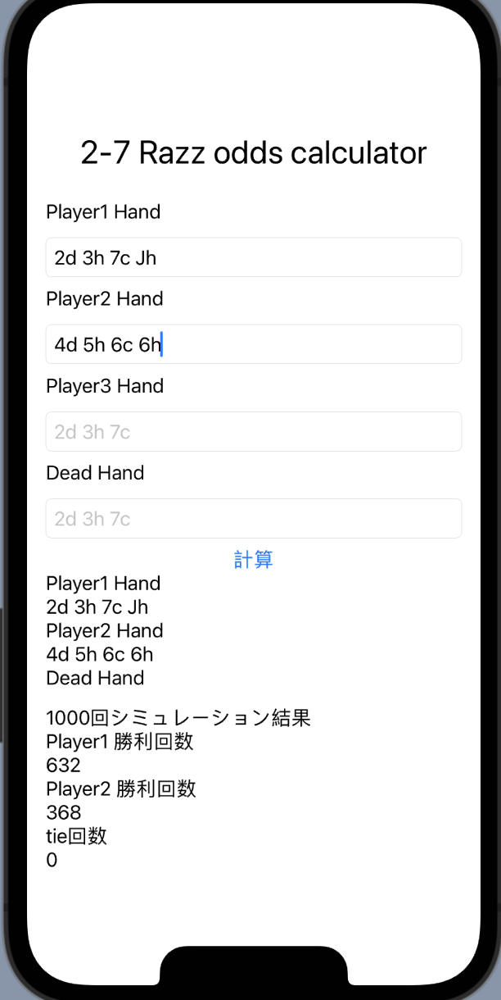

# mix-odds-calculator

ポーカーのマイナーなmix gameの勝率計算アプリ
現状勝率計算はUI上は3人入力可能であるが、ヘッズアップのみの対応となっている

## 現在対応しているゲーム

* 2-7 Razz
* Razzdugi
* Stud 30
* Double board Omaha Hi
* Double board Omaha Hi/Lo Best/Best

## 今後対応予定のゲーム

* Razzdeucy (2-5/2-7)

## ひょっとしたら対応

すでに世の中にあるので多分作らない

* Razz
* Stud Hi/Lo
* Big O

## 今後追加予定機能

* 3人以上の場合の勝率計算機能
* Equityだけではなく、ポットオッズも計算するように変更
* テキストではなく、カード選択による入力機能

## 画面例

